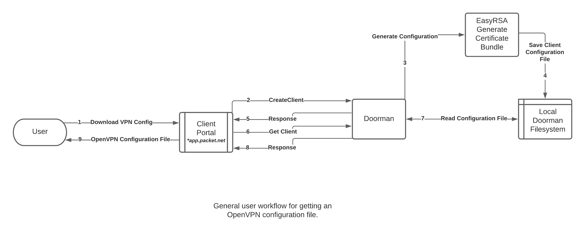
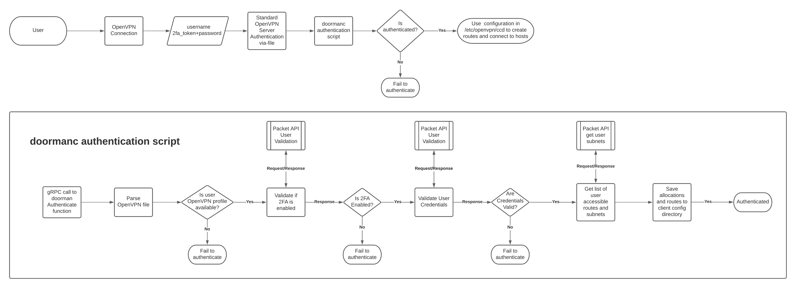

# Architecture

The Doorman project in a nutshell is a standard [OpenVPN](https://en.wikipedia.org/wiki/OpenVPN) server that utilizes a custom authentication scheme to gain access to private networks within a customer's issued private subnets.
OpenVPN is configured to utilize the [auth-user-pass-verify](https://openvpn.net/community-resources/using-alternative-authentication-methods/) method in the [server.conf](../../docker/openvpn/server.conf) file.

## Doorman

It's a grpc server that generates client-configuration for openvpn and provides a means of authentication against the public facing customer API.

## Doormanc

`doormanc` is a command line tool that calls gRPC functions within doorman to perform authentication and other maintenance items against the doorman container.

## Equinix Metal API

This is the API that creates user accounts in Doorman for consumer consumption. 

# How it works together
## Customer Configuration Workflow

The following flowchart shows the how a customer gets an OpenVPN configuration file:

[Click Here for a full sized image](../img/doorman_customer_workflow.png)

## Authentication Workflow

On a connection to OpenVPN, doorman acts as an authentication plugin. 
As mentioned in the overview, OpenVPN is configured to utilize the [auth-user-pass-verify](https://openvpn.net/community-resources/using-alternative-authentication-methods/) method which will execute a script during the authentication phase of a connection.
The scripts [authenticate.sh](../../docker/openvpn/authenticate.sh) and [disconnect.sh](../../docker/openvpn/disconnect.sh) respectively run on connection attempts and disconnections.

The following flowchart shows the generalized workflow:

[Click Here for a full sized image](../img/doorman_authentication_flow.png)